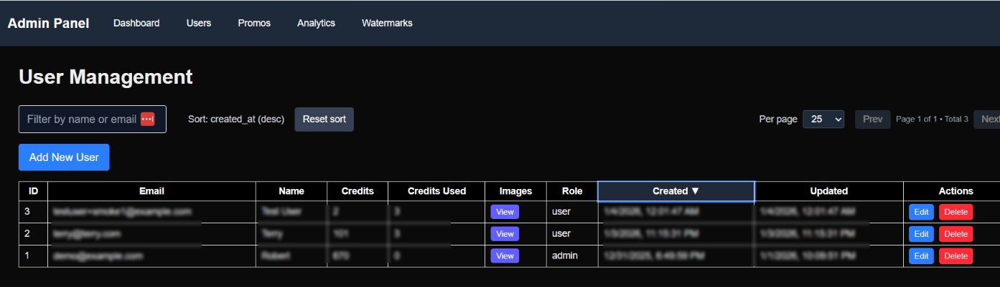
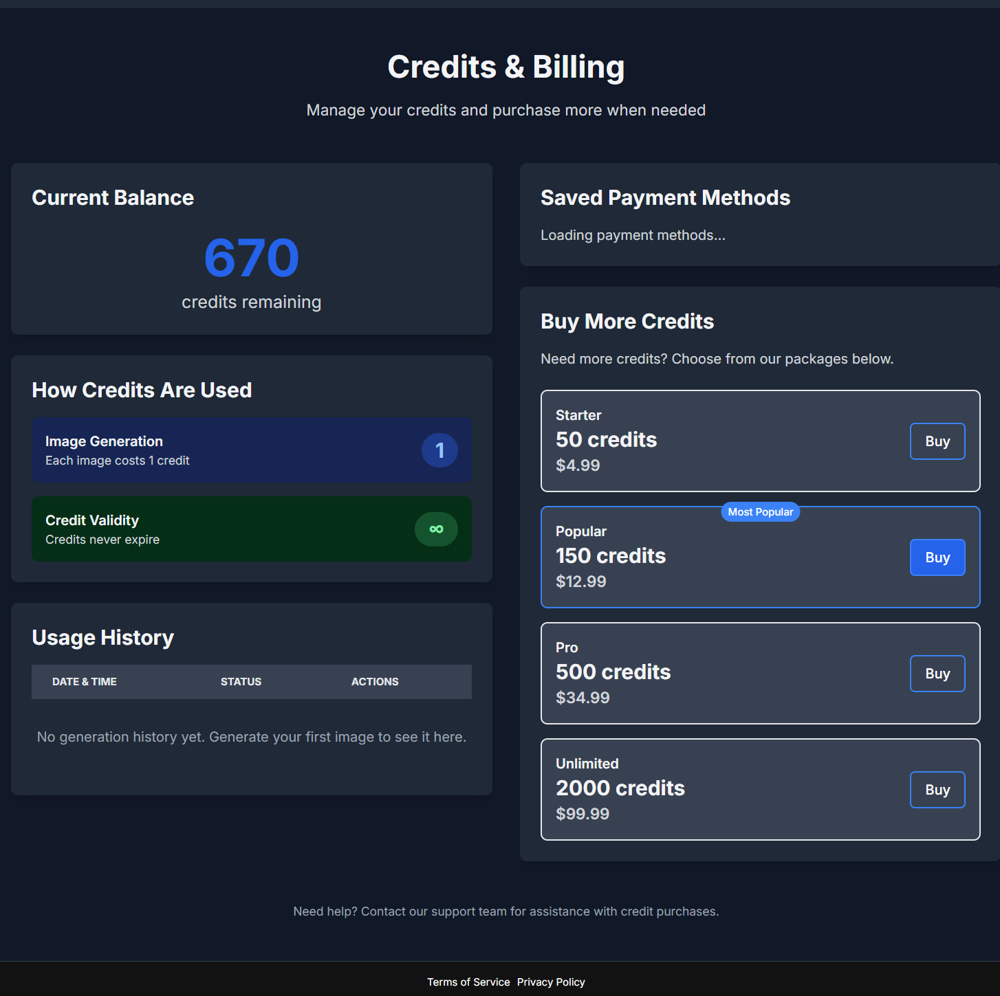
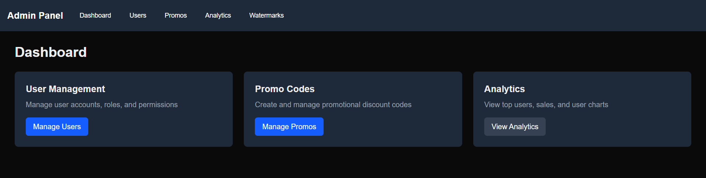
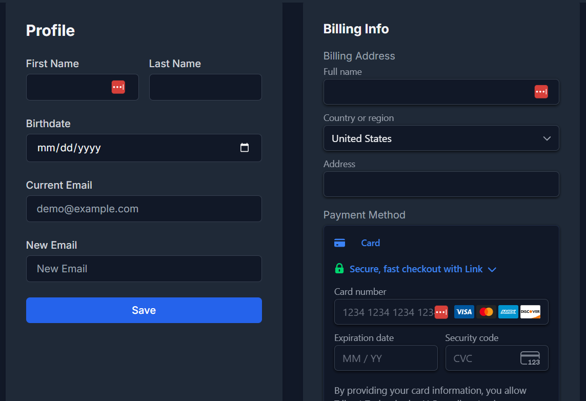
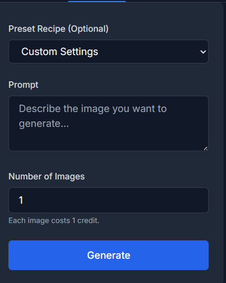
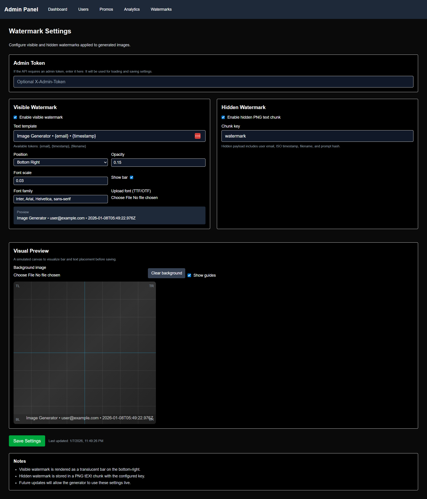

# Image Generator

A full-stack web application for AI-powered image generation with user authentication, credit system, and admin panel.

> **🎯 Portfolio Project:** This is a demonstration of full-stack development capabilities including modern web technologies, AI integration, cloud deployment, and scalable architecture. The code is shared for educational purposes to showcase development skills and is not intended for commercial use or easy deployment by others.

## Features

- **AI Image Generation**: Generate images using various AI models via RunPod serverless
- **User Authentication**: Secure login/signup with NextAuth.js
- **Credit System**: Purchase and track image generation credits
- **Admin Panel**: Manage users, view analytics, and system administration
- **Responsive Design**: Mobile-friendly interface built with Tailwind CSS
- **Docker Deployment**: Complete containerized setup for development and production

## Screenshots








## Tech Stack

- **Frontend**: Next.js 14, React, Tailwind CSS
- **Backend**: Next.js API routes, Prisma ORM
- **Database**: PostgreSQL
- **Authentication**: NextAuth.js with JWT
- **Caching**: Valkey (Redis-compatible)
- **Reverse Proxy**: Caddy
- **AI Generation**: RunPod serverless endpoints
- **Deployment**: Docker Compose

## Technical Skills Demonstrated

This project showcases expertise in:

- **Full-Stack Development**: Modern React/Next.js with server-side rendering
- **AI/ML Integration**: Stable Diffusion XL model deployment and API integration
- **Authentication & Security**: JWT tokens, secure API routes, input validation
- **Database Design**: PostgreSQL schema design, migrations, ORM usage
- **Microservices Architecture**: Containerized services with Docker Compose
- **Cloud Deployment**: Serverless AI endpoints, scalable infrastructure
- **Payment Integration**: Stripe API for credit-based subscriptions
- **DevOps**: Docker, environment management, reverse proxy configuration
- **UI/UX Design**: Responsive design, modern CSS frameworks, user experience
- **API Design**: RESTful endpoints, error handling, rate limiting

## Project Structure

```
├── next-backend/          # Next.js API server
├── next-frontend/         # Next.js client application
├── image-generator-endpoint/  # AI image generation service
├── docker-compose.yml     # Docker services
├── Caddyfile             # Reverse proxy config
├── init.sql              # Database schema
└── .env.example          # Environment variables template
```

## Quick Start

1. **Clone the repository**
   ```bash
   git clone <repository-url>
   cd image-generator
   ```

2. **Set up environment variables**
   ```bash
   cp .env.example .env.local
   # Edit .env.local with your API keys and secrets
   ```

3. **Start with Docker**
   ```bash
   docker-compose up -d
   ```

4. **Access the application**
   - Frontend: http://localhost
   - Admin panel: http://localhost/admin

## Environment Setup

### Required Environment Variables

- `IMAGE_GENERATOR_ENDPOINT_URL`: Your RunPod endpoint URL
- `IMAGE_GENERATOR_API_KEY`: RunPod API key
- `NEXTAUTH_SECRET`: Random secret for JWT tokens
- `DATABASE_URL`: PostgreSQL connection string
- `STRIPE_SECRET_KEY`: Stripe secret key for payments
- `NEXT_PUBLIC_STRIPE_PUBLISHABLE_KEY`: Stripe publishable key

### Optional Services

- **Kong API Gateway**: Uncomment in docker-compose.yml for production API management
- **AWS S3**: Configure for image storage in production

## Development

### Local Development

1. **Install dependencies**
   ```bash
   cd next-backend
   npm install
   cd ../next-frontend
   npm install
   ```

2. **Run database migrations**
   ```bash
   npx prisma migrate dev
   ```

3. **Start development server**
   ```bash
   npm run dev
   ```

### RunPod Endpoint

The image generation runs on RunPod serverless. See `image-generator-endpoint/README.md` for setup.

## Deployment

### Production Deployment

1. **Build and deploy containers**
   ```bash
   docker-compose -f docker-compose.yml up -d
   ```

2. **Set up domain and SSL**
   - Update Caddyfile with your domain
   - Caddy handles automatic SSL certificates

### AWS Deployment

For production scaling:
- Use AWS ECS/Fargate for containers
- Amazon RDS for PostgreSQL
- ElastiCache for Redis
- S3 for image storage
- CloudFront for CDN

## API Documentation

### Image Generation
```
POST /api/generate
{
  "prompt": "A beautiful landscape",
  "model": "flux-2-dev",
  "options": {...}
}
```

### User Management
```
GET /api/users
POST /api/credits/purchase
```

## Contributing

1. Fork the repository
2. Create a feature branch
3. Make your changes
4. Submit a pull request

## License

MIT License - see LICENSE file for details